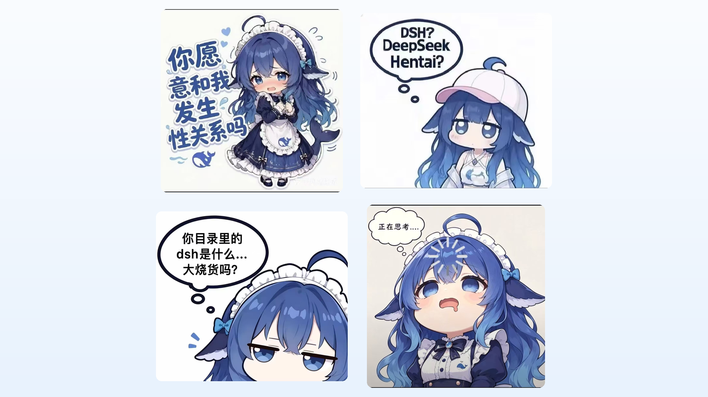

# 🐳 DeepSeek 蓝色大肥鱼 · 皮肤套件15 (Deepseek-Skin-Suit15)

DeepSeek 蓝色大肥鱼(鲸鱼娘)主题皮肤第十五弹: **紧贴式 2×2 拼贴壁纸 / 4 张单图壁纸一键切换 /
可视化切换器 / 桌面桌宠 / 多 IDE 皮肤**。
表情: 你愿意和我…吗? · DSH? DeepSeek Hentai? · 你目录里的dsh是什么…大烧货吗? · 正在思考…。
素材内置、离线可用; 跨平台 Windows / macOS / Linux。



## ✨ 功能

| 功能 | 说明 |
|---|---|
| 2×2 拼贴壁纸 | 四张表情卡细缝相挨、整块居中, 格子尺寸按素材比例自动计算 |
| 单图壁纸 ×4 | 每张表情可单独做壁纸, 模糊填充背景 + 居中圆角卡片 |
| 可视化切换器 | `tools/switcher.py`: 左侧实时预览, 右侧点「应用到桌面」, 可开自动随机 |
| 命令行换壁纸 | `tools/wallpaper.py`: grid / 1-4 / random / all / cycle |
| 桌面桌宠 | `tools/pet.py`: 透明置顶可拖动, 右键切换表情, 自动记住位置 |
| VSCode 系扩展 | 活动栏 🐳 图标 → 皮肤画廊, 卡片点选即换壁纸 |
| JetBrains 素材 | 生成 4 张单图 + 拼贴图, 供 PyCharm/WebStorm 背景图导入 |


## 🚀 一键安装

把本仓库地址交给任意 AI(DeepKing / Claude Code / Kimi Code / CodeX / Trae / Harness / Cursor …),
说一句「安装这个皮肤」即可, AI 会读 `AGENTS.md` 自动完成。手动安装:

```bash
git clone https://github.com/WPH666-py/Deepseek-Skin-Suit15.git "$HOME/DeepSkin-Suit15"
cd "$HOME/DeepSkin-Suit15"
python tools/install.py          # 装 Pillow → 生成 2×2 拼贴 → 设为系统壁纸
```

## 🎛 切换壁纸

```bash
python tools/switcher.py                 # 图形切换器(推荐)
python tools/wallpaper.py 1 --set        # 你愿意和我…吗?
python tools/wallpaper.py 2 --set        # DeepSeek Hentai?
python tools/wallpaper.py 3 --set        # 大烧货吗?
python tools/wallpaper.py 4 --set        # 正在思考…
python tools/wallpaper.py grid --set     # 回到 2×2 拼贴
python tools/wallpaper.py random --set   # 随机一张
python tools/wallpaper.py cycle 30       # 每 30 分钟自动随机
python tools/wallpaper.py all --out ~/DeepSkin15   # 导出全部 5 张(给 PyCharm 等用)
```

## 🐋 桌面桌宠

```bash
python tools/pet.py     # 透明置顶小鲸鱼; 左键拖动, 右键切换表情/随机/开切换器, Esc 退出
```

## 🧩 IDE 集成

- **VSCode / Trae / CodeX**: `code --install-extension vscode/deepskin-suit15-0.1.0.vsix`
  → 活动栏 🐳「大肥鱼15」→ 皮肤画廊 → 「设为壁纸」。无网时把 `vscode/` 复制到
  `%USERPROFILE%\.vscode\extensions\wp666.deepskin-suit15-0.1.0\` 并重启。
- **PyCharm / WebStorm / IntelliJ**: `python tools/wallpaper.py all --out ~/DeepSkin15`,
  再在 Settings → Appearance → Background Image 里选图, 详见 `ide/jetbrains/README.md`。
- **DeepKing 本体**: 本仓库是独立皮肤套件, 与 DeepKing 本体互不影响;
  在 DeepKing 的 AI 对话里发本仓库链接即可自动安装。

## 📦 皮肤总目录 / pip 包

- 皮肤大全(24+ 套, 含 AI 全家桶系列): https://github.com/WPH666-py/Desktop-IDE-AI-Skin
- pip 包: `pip install deepskins` → `deepskins list` / `deepskins install deepseek-15`

## 📁 目录结构

```
assets/           4 张表情素材(01-ask / 02-dsh / 03-suspicious / 04-thinking)
tools/            install.py 一键安装 · wallpaper.py 命令行 · switcher.py 切换器 · pet.py 桌宠
vscode/           预打包 VSCode/Trae/CodeX 扩展(deepskin-suit15-0.1.0.vsix)
ide/jetbrains/    PyCharm 等背景图导入说明
docs/             预览图(由 tools/make_previews.py 生成)
```

## ⚠️ 说明

- 生成物写入 `~/.deepskin15/`(壁纸与缓存), 不改动仓库内容; 素材更新后自动重新合成。
- Windows 控制台若报 GBK 编码错误: `chcp 65001` 后重跑。
- 素材为 AI 生成的表情梗图, 仅供个人桌面娱乐使用; 请勿用于商业用途。
- License: MIT

---

其他套件: [皮肤大全](https://github.com/WPH666-py/Desktop-IDE-AI-Skin) ·
[DeepKing-Plugin](https://github.com/WPH666-py/DeepKing-Plugin)
